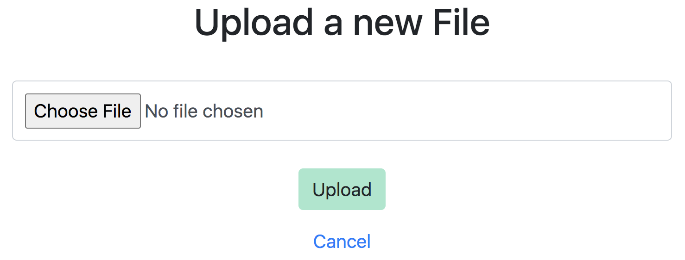

# Lookup App

This repository implements a web app where you can **upload** and **semantically** search across many of your documents.

This project has been implemented from scratch using the Flask micro web framework. It uses Google's Universal Sentence Encoder and an unsupervised algorithm to retrieve the closest segments of the documents you want to search across.

Think of it as a search engine, but for your documents!

## Installation and Usage

Just clone this repository and install the requirements

```bash
pip3 install -r requirements.txt
```
Run the Flask app
```bash
python app.py
```
You can either go to [localhost:5000](http://localhost:5000/) or deploy it on a server.

## How it looks like
First, upload your .docx documents
<p align="center">

</p>

You'll be redirected to the search homepage. Enter your query, and select the documents you want to search over from the list of uploaded files.
<p align="center">

</p>

These are the paragraphs/sentences that are semantically closest to your query. You can click on "See in context" to look at it as part of the whole file.

<p align="center">

</p>
## Summary
Suggestions are welcome. Please open an issue first to discuss what you would like to change.

## License
[MIT](https://choosealicense.com/licenses/mit/)
